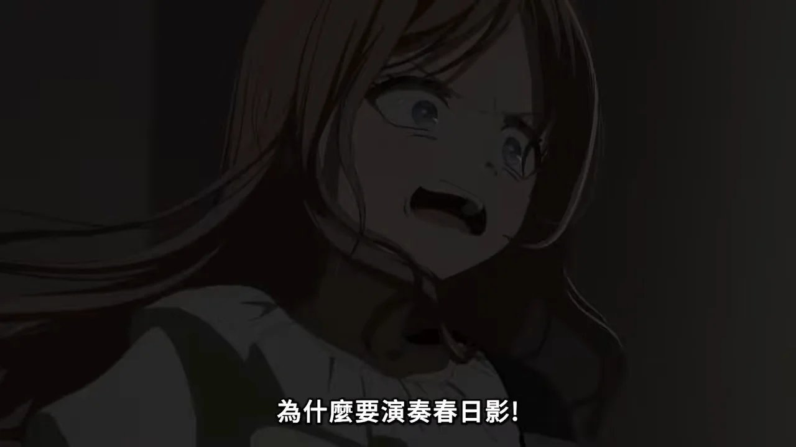
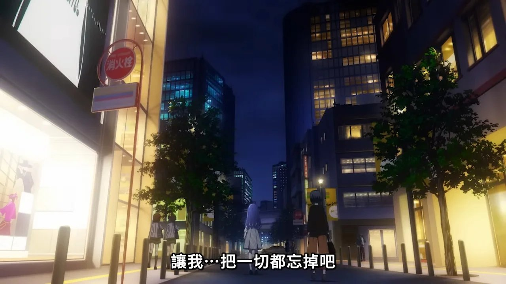

## **春日影** ***Haruhikage*** 

`time limit` 2s
`memory limit` 256MB

### ***Statement***

這天晚上，**祥子**和**睦**前去觀看 MyGO!!!!! 的演出。

演出剛開始，愛音就連續出錯，爽世被迫講話暖場，和樂奈聊起曾經的演奏經歷。愛音看到同學在台下為她加油，心情稍稍放鬆。演出繼續，燈依舊緊張，無法唱出聲音。燈看到台下的祥子和睦，祥子的目光幫助燈找回狀態。第一首歌演出結束，但是退場卻被燈的講話打斷。燈一直因為CRYCHIC解散而自責，這次見到祥子，當面說出了想認真唱歌，想認真組一輩子樂隊的決心。

燈話音剛落，樂奈開始彈起《春日影》的前奏。愛音憑藉肌肉記憶，儘量演奏，立希一直想演奏《春日影》，開心的配合，燈也認真唱起熟悉的歌詞，但是爽世卻把這首曲子當成禁忌，一直不想讓CRYCHIC以外的樂隊演奏，全程皺著眉頭。祥子聽到自己為燈譜曲的《春日影》，再看到燈身邊的新隊友，想到自己無法回到這個自己傾注了熱情的樂隊，想起無法複合的CRYCHIC，想起曾經退隊的愧疚，情緒崩潰，哭著跑開了。演出大獲成功，但是祥子崩潰，CRYCHIC重組的願望破滅，這讓爽世大受打擊。「為什麼要演奏《春日影》？」，爽世大聲表達不滿。



祥子獨自走在街上，看到sumimi的宣傳視頻，她打電話給三角初華，哭著說：「初華，拜託你……讓我把一切都忘掉吧。」（以上出自萌娘百科。）


（圖片來源：BanG Dream! AveMujica）


已知 MyGO!!!!! 每首歌曲都一個編號，如果編號是 $1$ ，代表該首歌是《春日影》。

本次 MyGO!!!!! 演出了 $n$ 首歌曲，依照順序是 $a_1,a_2, \dots , a_n$ ，祥子在聽到《春日影》之後就離場了，所以所有在《春日影》之後的歌曲祥子都沒有聽，所有在《春日影》(含) 之前的歌曲都有聽。

請你寫一個程式判斷祥子聽了幾首歌，以及哪些歌，並將聽過的歌按照歌曲編號**由小到大**排序。

### ***Input***

$n$
$a_1,a_2, \dots , a_n$

### ***Output***

請輸出一個正整數 $m$ 代表祥子聽了幾首歌曲，接者輸出 $m$ 個正整數，代表祥子聽到的歌曲按照編號由小到大。

### ***Sample Input 1***

```
5
3 8 4 1 2
```

### ***Sample Output 1***

```
4
1 3 4 8
```

### ***Sample Input 2***

```
10
2 5 3 14 27 8 34 9 50 11
```

### ***Sample Output 2***

```
10
2 3 5 8 9 11 14 27 34 50
```

### ***Note***

* $1 \le n \le 10^5$
* $1 \le a_i \le 10^9$
* 所有輸入數值皆為整數


